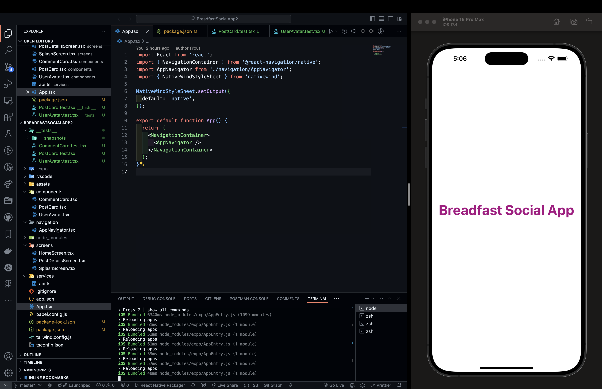
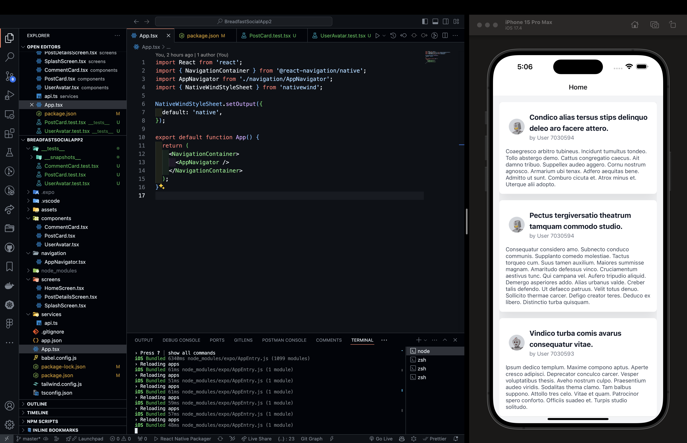
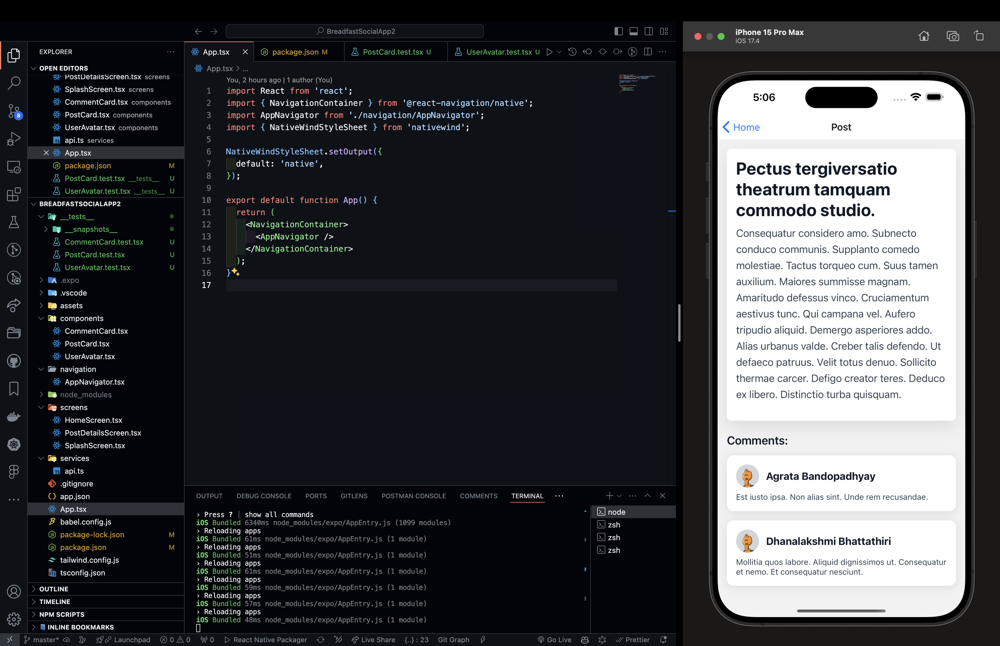

# Breadfast Social App

## Table of Contents

- [Breadfast Social App](#breadfast-social-app)
  - [Table of Contents](#table-of-contents)
  - [Description](#description)
  - [Features](#features)
  - [Installation](#installation)
  - [Usage](#usage)
  - [Configuration](#configuration)
  - [Testing](#testing)
  - [Screenshots](#screenshots)
    - [Home Screen](#home-screen)
    - [Post Details](#post-details)
    - [User Comments](#user-comments)
  - [Project Structure](#project-structure)
  - [Time Taken](#time-taken)

## Description

This is a task application for Breadfast designed to provide a seamless user experience. The app includes several key components and screens, with a focus on displaying user posts, comments, and avatars.

## Features

- Display list of posts
- View post details
- Show user comments and avatars
- Smooth navigation between screens

## Installation

To run this app locally, follow these steps:

1. **Clone the repository:**

   ```bash
   git clone git@github.com:1FaresKhalil/breadfast-social-app.git
   cd breadfast-social-app
   ```

2. **Install dependencies:**

   ```bash
   npm install
   ```

3. **Start the Expo server:**
   ```bash
   npm start
   ```

## Usage

After starting the Expo server, use the Expo Go app on your mobile device to scan the QR code generated in the terminal or visit the local server URL on an emulator.

## Configuration

- **Expo Configuration:** `app.json`
- **Babel Configuration:** `babel.config.js`
- **TypeScript Configuration:** `tsconfig.json`
- **Tailwind Configuration:** `tailwind.config.js`

## Testing

To run the tests for the components:

1. **Run the tests:**

   ```bash
   npm test
   ```

2. **Snapshot tests:** Located in `__tests__/__snapshots__`

## Screenshots

Below are some screenshots of the app in action:

### Home Screen



### Post Details



### User Comments



## Project Structure

/screens \n
/components \n
/services \n
/tests

## Time Taken

This project took approximately 4 hours to complete.
